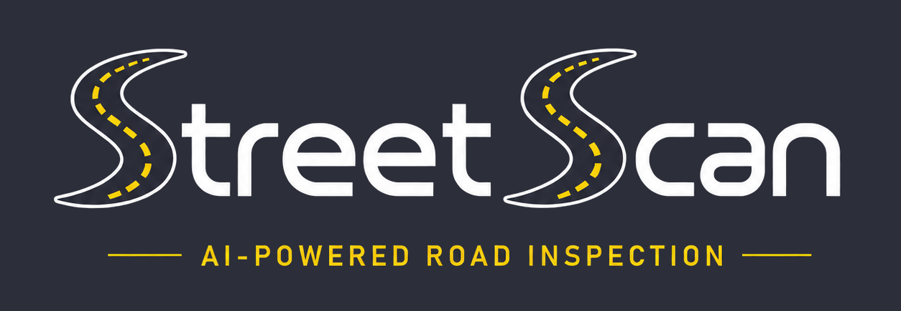

  

---

## Samsung Capstone Project

StreetScan is an AI-powered road inspection platform developed as part of the Samsung Capstone Project.

The application uses a custom-trained YOLO11 model to detect road damages such as potholes and pavement cracks from uploaded road images. After detection, Google Gemini generates a human-readable inspection report, which is stored along with the detection results for future reference.

The platform is designed to provide a simple workflow:

- Upload a road image
- Detect road damage using YOLO11
- Generate an AI inspection report
- Save reports to MongoDB
- View previous inspections
- Export reports as PDF documents

---

## Technology Stack

### Artificial Intelligence

- YOLO11
- Google Gemini

### Backend

- Python

### Database

- MongoDB

### Computer Vision

- OpenCV

### Web Application

- Streamlit

### PDF Generation

- ReportLab

### Version Control

- Git
- GitHub

---

## Current Features

- Road damage detection
- AI-generated inspection reports
- Report history
- PDF export
- Dark-themed dashboard

---

## Project Status

Currently under active development.
